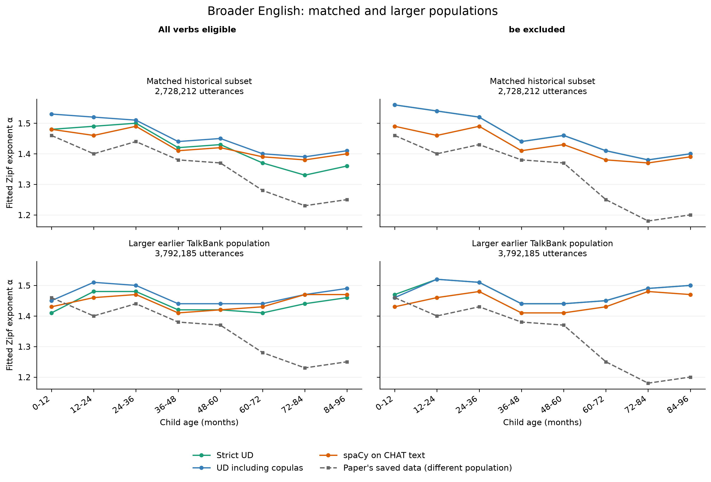

# Copula and `be` diagnostics — 2026-09-07

**Neither adding UD subject–copula pairs nor removing `be` restores the paper's
age-related decline in the larger earlier TalkBank population.** The matched
historical subset still declines under both interventions. A new spaCy parse of
the larger population also fails to reproduce the paper's decline, so that
failure is not specific to the strict UD extraction rule.

The copula convention does explain much of the UD–spaCy pair-count difference
and some differences in fitted alpha, especially in older matched bins. It does
not explain why the matched subset and larger population have different age
patterns. The exact full historical results remain unreproduced.

Each panel's solid lines share the same utterances and ages. The dashed line
uses the paper's different, larger historical dataset; the right column also
removes `be` from those saved paper pairs. Strict and augmented UD largely
overlap after removing `be`. [Export this figure as PDF](output/copula_report_v2/population_comparison.pdf).

## What the diagnostics changed

The strict rule counts an exact `nsubj` dependency whose head has VERB or AUX
POS. UD represents “She is happy” with `she` attached to `happy` as `nsubj` and
`is` attached to `happy` as `cop`. Thus that strict rule misses `(she, be)`.
This follows the [official UD copula convention](https://universaldependencies.org/u/dep/cop.html).

The augmented rule preserves every strict pair and adds subject–copula pairs
when exact `nsubj` and `cop` dependents share a nonverbal predicate, and the
copula has VERB/AUX POS and a valid lemma. These are explicitly derived pairs,
not native direct UD subject-to-copula edges. It does not infer subjects across
conjunctions or add auxiliary, passive or progressive bridges. Multiple direct
subjects/copulas generate their direct combinations; disfluencies and annotation
errors in the source are not manually corrected. `pair_origin` and the separate
`copula_additions.csv` preserve the derivation and predicate for inspection.

The second diagnostic removes every pair whose verb lemma is `be`, including
noncopular uses. It is a lemma ablation, not a filter restricted to copular
sentences. Both strict and augmented UD are fitted without `be`, because a small
number of explicit `cop` annotations have other lemmas.

All conditions use the original fitting calculation. The top 100 eligible verbs
are selected again within each age, scope, method and filter. Subject proportions
are normalized within verbs, averaged at each available rank and renormalized
before the unchanged 291-point alpha search. A large pair-count change therefore
does not imply a comparably large alpha change.

## Main results

The entries below are **youngest-bin → oldest-bin alpha**, using 0–12 and
84–96 months. These describe endpoints; none of these curves is monotonic.
The paper row is the verified saved historical analysis, not an Eng-NA-only
baseline; see the [paper provenance check](DATA_PROVENANCE.md#connection-to-claires-paper).

| Data and method | All verbs | Excluding `be` |
| --- | ---: | ---: |
| Paper's saved spaCy data | 1.46 → 1.25 | 1.46 → 1.20 |
| Matched broader English, strict UD | 1.48 → 1.36 | 1.56 → 1.40 |
| Matched broader English, UD including copulas | 1.53 → 1.41 | 1.56 → 1.40 |
| Matched broader English, spaCy on CHAT text | 1.48 → 1.40 | 1.49 → 1.39 |
| Larger earlier broader English, strict UD | 1.41 → 1.46 | 1.47 → 1.50 |
| Larger earlier broader English, UD including copulas | 1.45 → 1.49 | 1.46 → 1.50 |
| Larger earlier broader English, spaCy on CHAT text | 1.43 → 1.47 | 1.43 → 1.47 |

Eng-NA gives the same qualitative distinction. Adding copulas changes the
matched endpoints to **1.53 → 1.40**, and the larger population's endpoints to
**1.44 → 1.53**. Without `be`, strict UD gives **1.56 → 1.38** on the matched
subset and **1.44 → 1.55** on the larger population. The corresponding spaCy
no-`be` endpoints are **1.49 → 1.36** and **1.42 → 1.51**.

Copulas help reconcile some older-bin differences between parsers. In matched
Eng-NA at 72–84 months, strict UD gives 1.24, augmented UD 1.33, and spaCy 1.32.
Without `be`, strict UD and spaCy give 1.28 and 1.27. But younger bins still
differ: at 0–12 months, augmented UD gives 1.53 versus spaCy's 1.49, and strict
UD without `be` gives 1.56 versus spaCy's 1.49. This is not complete agreement
between methods.

Removing `be` from the paper's original saved pairs leaves its overall alpha
at 1.43 and makes its endpoint decline larger: −0.26 instead of −0.21. The
full eight-bin sequence becomes **1.46, 1.40, 1.43, 1.38, 1.37, 1.25, 1.18,
1.20**. Thus inclusion of `be` cannot be the sole explanation of the paper's
decline. This analysis removes 859,902 `be` pairs and retains 1,942,169 pairs
with the original 4,739,189-utterance denominator.

## Pair counts and verb selection

These counts include the overall age ≤96 population. spaCy here uses CHAT text.

| Population and scope | Utterances | Strict UD pairs | Added copula pairs | Augmented UD pairs | spaCy pairs |
| --- | ---: | ---: | ---: | ---: | ---: |
| Matched Eng-NA | 969,399 | 466,656 | 156,273 | 622,929 | 669,790 |
| Matched broader English | 2,728,212 | 1,303,637 | 454,436 | 1,758,073 | 1,886,034 |
| Larger earlier Eng-NA | 1,607,773 | 766,392 | 243,252 | 1,009,644 | 1,081,580 |
| Larger earlier broader English | 3,792,185 | 1,775,181 | 595,023 | 2,370,204 | 2,560,533 |

The augmentation closes **78.0% of the matched** and **75.8% of the larger**
broader-English net pair-count gaps between strict UD and spaCy. This is a
comparison of total counts, not an alignment asserting that those exact pairs
also occur in spaCy, nor a percentage of the age effect explained.

Of the 454,436 matched additions, 453,662 have lemma `be` and 774 have other
lemmas. Of the 595,023 larger-population additions, 593,972 have lemma `be`
and 1,051 have other lemmas. Non-`be` examples include `get`, `do`, `hafta`
and `would`; these follow the source's explicit labels rather than a manual
decision that every occurrence is a canonical copula.

On matched broader English, `be` pairs increase from 87,962 in strict UD to
541,624 after augmentation, versus spaCy's 581,865. On the larger population,
they increase from 113,123 to 707,095, versus spaCy's 764,120. These are
subject–verb pair occurrences, not raw counts of the word “be”.

The top-verb audit finds that removing `be` replaces exactly one of the 100
selected verbs in every matched/larger fit. Adding copulas preserves all 100
selected verbs in every matched fit; on the larger population, overlap is
99–100. Thus the matched augmentation effect occurs without changing which
verbs are selected. The no-`be` effect combines removal of `be` with admitting
the next eligible verb, as the original procedure requires.
[Top-verb overlaps and replacements](output/copula_verification_reusable_v2/top_verb_overlap.csv) and
[pair additions/removals by age and scope](output/copula_verification_reusable_v2/pair_effects.csv)
retain the detailed counts.

## What was held fixed, and what remains unresolved

The larger population is exactly the earlier TalkBank run's 3,792,185
age-eligible CDS utterances, with the same sources and current/recovered ages.
All nine strict-control fits reproduce the earlier results exactly in each
scope. There is no new matching, source substitution or annotation-availability
restriction in this population.

The matched population is the existing 2,728,212 historical matches, using
exact original CSV ages, independently corroborated transcript identity/age,
and the separately preserved original Hall and McCune versions. Its previous
strict UD and both spaCy controls reproduce exactly. It covers 57.6% of the
paper's analyzed utterances. It contains Eng-NA, Eng-UK and Clinical-Eng;
Eng-AAE contributes no matched rows. [MATCHED_RESULTS.md](MATCHED_RESULTS.md)
documents the matching and age-specific coverage.

Consequently, matched versus larger is **not simply an add-back of otherwise
identical observations**. Selection, transcript versions, annotation coverage
and age provenance differ between those populations. These diagnostics do not
identify which of those differences drives the age-pattern reversal. They do
show that the copula rule and `be` inclusion do not resolve it. Attributing the
remaining difference requires a separate comparison that holds source versions
and age policy fixed while adding observations or corpora.

Within each population and scope, every method/filter retains the same
utterance denominator, including utterances yielding no pairs. The larger
population includes 186,082 utterances without UD tiers, alongside 3,606,103
annotated utterances. spaCy produces 22,588 pairs from those missing-tier rows
(2,560 in Eng-NA). Thus the full spaCy–UD comparison includes annotation
availability; the strict–augmented UD intervention itself changes only the
copula extraction rule. The [annotation audit](output/copula_full_spacy_chat/annotation_availability.json)
breaks this down by collection and age. Forty-six empty texts are retained
as empty; they are nonlexical Forrester events and are not replaced by raw
CHAT control text.

The original overall rule includes age exactly 96 months, whereas the eight
age bins exclude it. The larger population has 54 such utterances, 11 strict
UD pairs and one added copula pair; these contribute only to the overall fit.
The matched population has no such rows. This boundary convention is unchanged.

These are descriptive fitted point estimates, with no bootstrap intervals or
formal estimate of an age effect. Older matched bins have substantially less
data, and their fluctuations remain visible. Neither matching nor these
diagnostics establishes a complete replication or a contradiction of the
historical finding.

## Full fitted values

All columns use the same fitting procedure. `UD+cop` means the augmented rule;
`−be` means all `be`-lemma pairs removed. The matched original-CSV-text spaCy
control is retained in the full CSV alongside the CHAT-text results below.
The [generated tables](output/copula_report_v2/alpha_tables.md) and
[endpoint comparisons](output/copula_report_v2/endpoints.csv) can be regenerated
with `plot_copula_comparison.py`; the README documents the command.

### Larger earlier TalkBank population: Eng-NA

| Age (months) | UD | UD+cop | spaCy | UD −be | UD+cop −be | spaCy −be |
| --- | ---: | ---: | ---: | ---: | ---: | ---: |
| Overall | 1.47 | 1.48 | 1.45 | 1.49 | 1.49 | 1.45 |
| 0–12 | 1.40 | 1.44 | 1.42 | 1.44 | 1.44 | 1.42 |
| 12–24 | 1.44 | 1.47 | 1.43 | 1.48 | 1.48 | 1.43 |
| 24–36 | 1.42 | 1.44 | 1.42 | 1.45 | 1.45 | 1.42 |
| 36–48 | 1.41 | 1.43 | 1.41 | 1.44 | 1.44 | 1.40 |
| 48–60 | 1.41 | 1.44 | 1.41 | 1.45 | 1.45 | 1.41 |
| 60–72 | 1.44 | 1.47 | 1.46 | 1.48 | 1.48 | 1.45 |
| 72–84 | 1.42 | 1.46 | 1.46 | 1.47 | 1.47 | 1.46 |
| 84–96 | 1.50 | 1.53 | 1.50 | 1.55 | 1.55 | 1.51 |

### Larger earlier TalkBank population: broader English

| Age (months) | UD | UD+cop | spaCy | UD −be | UD+cop −be | spaCy −be |
| --- | ---: | ---: | ---: | ---: | ---: | ---: |
| Overall | 1.48 | 1.49 | 1.47 | 1.50 | 1.50 | 1.46 |
| 0–12 | 1.41 | 1.45 | 1.43 | 1.47 | 1.46 | 1.43 |
| 12–24 | 1.48 | 1.51 | 1.46 | 1.52 | 1.52 | 1.46 |
| 24–36 | 1.48 | 1.50 | 1.47 | 1.51 | 1.51 | 1.48 |
| 36–48 | 1.42 | 1.44 | 1.41 | 1.44 | 1.44 | 1.41 |
| 48–60 | 1.42 | 1.44 | 1.42 | 1.44 | 1.44 | 1.41 |
| 60–72 | 1.41 | 1.44 | 1.43 | 1.45 | 1.45 | 1.43 |
| 72–84 | 1.44 | 1.47 | 1.47 | 1.49 | 1.49 | 1.48 |
| 84–96 | 1.46 | 1.49 | 1.47 | 1.50 | 1.50 | 1.47 |

### Matched historical subset: Eng-NA

| Age (months) | UD | UD+cop | spaCy | UD −be | UD+cop −be | spaCy −be |
| --- | ---: | ---: | ---: | ---: | ---: | ---: |
| Overall | 1.47 | 1.48 | 1.45 | 1.50 | 1.50 | 1.45 |
| 0–12 | 1.47 | 1.53 | 1.49 | 1.56 | 1.56 | 1.49 |
| 12–24 | 1.44 | 1.48 | 1.43 | 1.51 | 1.50 | 1.43 |
| 24–36 | 1.41 | 1.44 | 1.41 | 1.44 | 1.44 | 1.41 |
| 36–48 | 1.41 | 1.44 | 1.41 | 1.44 | 1.44 | 1.41 |
| 48–60 | 1.42 | 1.44 | 1.42 | 1.45 | 1.45 | 1.41 |
| 60–72 | 1.39 | 1.44 | 1.44 | 1.45 | 1.45 | 1.43 |
| 72–84 | 1.24 | 1.33 | 1.32 | 1.28 | 1.28 | 1.27 |
| 84–96 | 1.33 | 1.40 | 1.38 | 1.38 | 1.38 | 1.36 |

### Matched historical subset: broader English

| Age (months) | UD | UD+cop | spaCy | UD −be | UD+cop −be | spaCy −be |
| --- | ---: | ---: | ---: | ---: | ---: | ---: |
| Overall | 1.50 | 1.51 | 1.48 | 1.52 | 1.52 | 1.48 |
| 0–12 | 1.48 | 1.53 | 1.48 | 1.56 | 1.56 | 1.49 |
| 12–24 | 1.49 | 1.52 | 1.46 | 1.54 | 1.54 | 1.46 |
| 24–36 | 1.50 | 1.51 | 1.49 | 1.52 | 1.52 | 1.49 |
| 36–48 | 1.42 | 1.44 | 1.41 | 1.44 | 1.44 | 1.41 |
| 48–60 | 1.43 | 1.45 | 1.42 | 1.46 | 1.46 | 1.43 |
| 60–72 | 1.37 | 1.40 | 1.39 | 1.41 | 1.41 | 1.38 |
| 72–84 | 1.33 | 1.39 | 1.38 | 1.38 | 1.38 | 1.37 |
| 84–96 | 1.36 | 1.41 | 1.40 | 1.40 | 1.40 | 1.39 |

## Artifacts and verification

- [Matched 144-row summary](output/copula_matched_fits/copula_summary.csv): four
  methods × two filters × two scopes × nine overall/age fits.
- [Larger-population 108-row summary](output/copula_full_fits/copula_summary.csv):
  three methods × two filters × two scopes × nine overall/age fits.
- [Paper's nine fits without `be`](output/copula_paper_without_be/summary.csv).
- [Matched all-verbs figure](output/copula_matched_fits/copula_all_verbs.png) and
  [matched no-`be` figure](output/copula_matched_fits/copula_without_be.png).
- [Larger all-verbs figure](output/copula_full_fits/copula_all_verbs.png) and
  [larger no-`be` figure](output/copula_full_fits/copula_without_be.png), including
  Eng-NA separately from broader English.
- [Matched augmentation metadata](output/copula_matched_ud/metadata.json) and
  [larger augmentation metadata](output/copula_full_ud/metadata.json), including
  source hashes and raw annotation checks.
- [Matched pair integrity audit](output/copula_matched_integrity_reusable.json)
  and [larger pair integrity audit](output/copula_full_integrity_reusable.json):
  strict pairs preserved field for field and in order; augmented keys unique;
  all pair ages and row metadata agree with their population.
- [Independent numerical verification](output/copula_verification_reusable_v2/verification.json):
  261 curves, all 75,951 MSE grid values, rank proportions, predictions, minima,
  denominators recounted from source CSVs, exact age-bin coverage, no-`be`
  filters, published input paths and artifact hashes.

The saved source programs [plot_copula_comparison.py](plot_copula_comparison.py),
[verify_copula_results.py](verify_copula_results.py) and
[audit_copula_pairs.py](audit_copula_pairs.py) regenerate the reporting and checks.
The original inspection outputs are retained; these reusable programs and their
documented commands are the entry points for future runs.

All 93 tests pass; Python compilation and `git diff --check` pass. The original
analysis scripts, CSV and saved outputs remain unchanged. Reproduction commands
are in [README.md](README.md#copula-and-be-diagnostics); use fresh output
directories when repeating runs.
