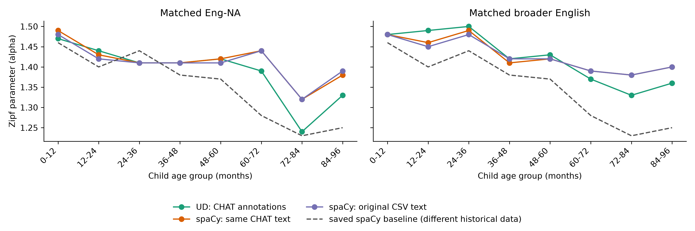

# Matched English CHILDES results — 2026-09-07

**The selected matched subset shows a descriptive age decline; the larger
earlier TalkBank population does not reproduce the paper's decline.** On matched
Eng-NA, alpha falls from 1.47 at 0–12 months to 1.33 at 84–96 months; on matched
broader English, it falls from 1.48 to 1.36. Both matched spaCy analyses also
have lower exponents in the oldest bin than in the youngest. The curves fluctuate
and rebound in the final bin; no statistical age effect with uncertainty
intervals has been estimated.

Matching makes the parser comparison controlled within this subset, but does
not establish reproduction of the full historical analysis. Population
selection, transcript versions and age provenance differ from the earlier
larger run. The matched spaCy controls also differ from the saved paper values,
so the remaining gap cannot be assigned solely to changing from spaCy to UD.

**Latest follow-up:** [COPULA_RESULTS.md](COPULA_RESULTS.md) adds UD copulas and
removes `be` in both populations. The matched decline persists, while neither
intervention restores the larger population's decline. The new larger-population
spaCy run also fails to reproduce that decline.



The dashed saved baseline uses a different, larger historical dataset. It is
shown as a reference in both panels; it is not a separately verified Eng-NA
baseline. Every solid line within a panel uses the same matched utterances and
exact historical ages.

The saved baseline matches Table 3 in Claire Hobbs and R. Thomas McCoy's
paper: all eight exponents and the utterance, pair, and vocabulary counts agree
exactly. The preprint describes English-tagged participants; the thesis and
earlier draft describe Eng-NA. See the
[paper-to-output provenance check](DATA_PROVENANCE.md#connection-to-claires-paper).

## Fitted exponents

All fits use the unchanged original calculation: top 100 eligible verbs,
subject proportions within each verb, mean proportion at each available rank,
renormalization, and the 291-point alpha grid from 0.10 through 3.00. Each arm
and age bin reselects its own top verbs, following the original code. Ages use
lower-inclusive, upper-exclusive bins; overall retains the original age ≤96
rule. These are point estimates.

### Eng-NA: 969,399 matched utterances

| Age (months) | UD, CHAT annotations | spaCy, same CHAT text | spaCy, original CSV text | Saved full baseline, different data |
| --- | ---: | ---: | ---: | ---: |
| Overall | 1.47 | 1.45 | 1.45 | 1.43 |
| 0–12 | 1.47 | 1.49 | 1.48 | 1.46 |
| 12–24 | 1.44 | 1.43 | 1.42 | 1.40 |
| 24–36 | 1.41 | 1.41 | 1.41 | 1.44 |
| 36–48 | 1.41 | 1.41 | 1.41 | 1.38 |
| 48–60 | 1.42 | 1.42 | 1.41 | 1.37 |
| 60–72 | 1.39 | 1.44 | 1.44 | 1.28 |
| 72–84 | 1.24 | 1.32 | 1.32 | 1.23 |
| 84–96 | 1.33 | 1.38 | 1.39 | 1.25 |

### Broader English: 2,728,212 matched utterances

| Age (months) | UD, CHAT annotations | spaCy, same CHAT text | spaCy, original CSV text | Saved full baseline, different data |
| --- | ---: | ---: | ---: | ---: |
| Overall | 1.50 | 1.48 | 1.48 | 1.43 |
| 0–12 | 1.48 | 1.48 | 1.48 | 1.46 |
| 12–24 | 1.49 | 1.46 | 1.45 | 1.40 |
| 24–36 | 1.50 | 1.49 | 1.48 | 1.44 |
| 36–48 | 1.42 | 1.41 | 1.42 | 1.38 |
| 48–60 | 1.43 | 1.42 | 1.42 | 1.37 |
| 60–72 | 1.37 | 1.39 | 1.39 | 1.28 |
| 72–84 | 1.33 | 1.38 | 1.38 | 1.23 |
| 84–96 | 1.36 | 1.40 | 1.40 | 1.25 |

The two spaCy text representations differ by at most 0.01 in any fitted alpha.
Thus the original CSV's missing punctuation and related surface differences
have little impact on this fitted statistic in the matched sample. The UD and
spaCy curves still differ, particularly in the older bins. For example, Eng-NA
at 72–84 months gives 1.24 for UD and 1.32 for both spaCy arms. This difference
includes dependency conventions, parser output, lemmatization, and the resulting
top-verb selection; the experiment does not isolate those components individually.

[Full 54-row summary](output/matched_comparison/matched_comparison_summary.csv)
contains pair counts, vocabulary sizes and MSEs. Each of the six fit directories
also retains ranked subjects, rank averages, top verbs, predictions and every
MSE grid point.

## What was matched, and where the ages came from

The original `childes_full_utterances_20251211_120050.csv` anchors both population
and ages. Eligible CHAT transcripts require a unique strong multi-utterance
content link, a corroborating CHAT or previously verified legacy age within
0.1 months, compatible known child names, verified source bytes and no raw ASR
flag. Unknown names are retained as unknown. The CSV has no CHAT filenames or
PIDs, so this is evidence from text, speakers and independent age metadata.

Within those transcripts, the intersection requires the same speaker code,
role and lexical token sequence. Matching permits case, punctuation, apostrophe
and specified clitic-spacing differences while preserving word boundaries and
internal hyphens. Each original occurrence is consumed at most once. Repeated
identical utterances retain their frequency, but the procedure does not claim
a globally monotonic sequence alignment. The preserved CHAT text and original
CSV text are parsed separately; matching-normalized text is never parser input.

The eligible cohort has 6,908 transcripts, of which 6,866 contribute matches.
It contains 3,016,731 usable historical utterances; 2,728,212 are matched
(**90.4%**). The full original analysis has 4,739,189 usable utterances, so the
matched sample covers **57.6% of the historical analysis**. Broader English here
contains Eng-NA (969,399), Eng-UK (1,221,206) and Clinical-Eng (537,607); no
Eng-AAE transcripts met the matching criteria.

| Age (months) | Full historical utterances | Matched utterances | Coverage of full historical data | Matched Eng-NA utterances |
| --- | ---: | ---: | ---: | ---: |
| Overall | 4,739,189 | 2,728,212 | 57.6% | 969,399 |
| 0–12 | 182,023 | 69,941 | 38.4% | 68,282 |
| 12–24 | 671,559 | 356,114 | 53.0% | 204,262 |
| 24–36 | 1,900,684 | 1,226,011 | 64.5% | 266,001 |
| 36–48 | 923,858 | 555,676 | 60.1% | 162,502 |
| 48–60 | 621,805 | 358,251 | 57.6% | 199,456 |
| 60–72 | 237,449 | 91,419 | 38.5% | 42,416 |
| 72–84 | 111,117 | 31,229 | 28.1% | 7,639 |
| 84–96 | 90,694 | 39,571 | 43.6% | 18,841 |

Older bins have substantially less data and incomplete historical coverage.
The matched subset and the unrecorded original spaCy/model version remain
limits on exact historical reproduction. The original database export version
also remains unconfirmed; see [DATA_PROVENANCE.md](DATA_PROVENANCE.md).

## Original Hall and McCune sources

The audit of all 98 official corpus pages found separately preserved original
Hall and McCune archives. Those replace their current corpus versions before
matching, with source hashes and identity checks retained. The match includes
99,577 Hall utterances and 13,232 McCune utterances. Their annotation provenance
is recorded separately from the current Stanza annotations.

A sensitivity analysis excludes both corpora and reruns all three Eng-NA arms
on the same remaining **856,590 utterances**. Changes to alpha are at most 0.02,
and every 60–96-month estimate is unchanged. These alternate sources do not
drive the observed late-age decline.

| Age (months), excluding Hall and McCune | UD | spaCy, CHAT text | spaCy, original CSV text |
| --- | ---: | ---: | ---: |
| Overall | 1.46 | 1.45 | 1.45 |
| 0–12 | 1.47 | 1.49 | 1.48 |
| 12–24 | 1.42 | 1.42 | 1.41 |
| 24–36 | 1.41 | 1.41 | 1.41 |
| 36–48 | 1.41 | 1.41 | 1.41 |
| 48–60 | 1.40 | 1.40 | 1.40 |
| 60–72 | 1.39 | 1.44 | 1.44 |
| 72–84 | 1.24 | 1.32 | 1.32 |
| 84–96 | 1.33 | 1.38 | 1.39 |

[Full sensitivity summary](output/matched_source_sensitivity/sensitivity_summary.csv)
and [source metadata](output/matched_source_sensitivity/metadata.json) retain
filtered counts and hashes.

## Verification and reproducibility

The broad matched dataset yields 1,303,637 UD pairs, 1,886,034 spaCy CHAT-text
pairs and 1,901,720 spaCy original-text pairs. Utterances without a pair remain
in all denominator counts. The same spaCy 3.8.13 and `en_core_web_sm` 3.8.0
model were used for both controls.

All 2,728,212 CHAT row identities and historical occurrence identities are
unique. Every pair in all three arms was checked against the matched table for
its utterance identity, historical age, original ID/order/speaker/text, and CHAT
speaker/role. The [integrity audit](output/matched_integrity_audit.json) records
these checks, pair hashes, source hashes and parser-version equality. An
independent [32-row source audit](output/matched_row_audit.json), sampling four
rows per age bin, re-read both the raw CHAT sources and original CSV.

The 70-test suite passes, including matching safeguards, zero-pair denominator
handling, real-model shard equivalence and a complete six-fit fixture. Final
checks verify identical per-bin denominators across arms, all 291 MSE grid points
and their minima for all 81 curves, and published input paths. The
[final verification record](output/matched_final_verification.json) also hashes
465 output artifacts. The fitter's earlier numerical
parity checks against all nine saved historical pair datasets also pass.

[README reproduction commands](README.md#matched-historical-comparison) rebuild
the match and all three analysis arms. Run the source sensitivity separately:

```sh
.venv/bin/python fit_source_sensitivity.py \
  --matched output/matched_historical_data \
  --spacy-chat output/matched_spacy_chat \
  --spacy-original output/matched_spacy_original \
  --output output/matched_source_sensitivity
```

Original scripts, the source CSV and saved historical outputs were preserved.
The first live-download result remains in [RESULTS.md](RESULTS.md).
