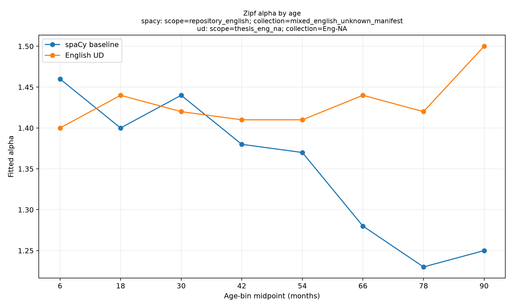

# English CHILDES reproduction results — 2026-09-07

**Latest follow-up:** [COPULA_RESULTS.md](COPULA_RESULTS.md) tests adding UD
copulas and excluding `be` on both populations. Neither restores the paper's
decline in the larger earlier population. [MATCHED_RESULTS.md](MATCHED_RESULTS.md)
reports the descriptive decline on identical matched utterances and historical
ages. The results below retain the earlier live-download experiment for provenance.

**Data-source clarification:** These results describe the first comparison
against live TalkBank downloads, not a comparison using the same historical
transcript versions. A follow-up source audit found the separately advertised
Hall original-transcript archive, containing ages and UD-style annotations,
where the live Hall download contains replacement ASR. It is downloaded but is
not included in the fits below. See [DATA_PROVENANCE.md](DATA_PROVENANCE.md).
These first-run curves do not establish a contradiction of the historical
finding; consult the matched follow-up for the controlled comparison.

The TalkBank UD/PyLangAcq runs reproduce the approximate overall exponent, but
**do not reproduce the historical decline with target-child age**. Both current
corpus scopes retain exponents around 1.4–1.5 in the oldest bins, where the
saved spaCy analysis falls to 1.23–1.25. Verified age recovery changes individual
exponents by at most 0.01 and does not restore that decline.

The fitting implementation passes numerical comparisons against all nine
original saved pair datasets, including subject ranks, rank averages and every
point of the 291-value MSE search. This rules out a change to that calculation
as the explanation. Corpus membership, available ages, speaker metadata and
dependency analyses still differ; this is not a controlled parser-only comparison.

## Fitted exponents

Age bins are lower-inclusive and upper-exclusive. Overall follows the original
`age <= 96` rule. These are point estimates, without bootstrap intervals.

| Target-child age (months) | Saved spaCy baseline | Current UD: Eng-NA | Current UD: broader English |
| --- | ---: | ---: | ---: |
| Overall | 1.43 | 1.47 | 1.48 |
| 0–12 | 1.46 | 1.40 | 1.41 |
| 12–24 | 1.40 | 1.44 | 1.48 |
| 24–36 | 1.44 | 1.42 | 1.48 |
| 36–48 | 1.38 | 1.41 | 1.42 |
| 48–60 | 1.37 | 1.41 | 1.42 |
| 60–72 | 1.28 | 1.44 | 1.41 |
| 72–84 | 1.23 | 1.42 | 1.44 |
| 84–96 | 1.25 | 1.50 | 1.46 |

The spaCy line represents the saved repository dataset, not an independently
verified Eng-NA-only reference. The [broader English plot](output/repository_comparison/alpha_age_trajectory.png)
shows the second scope separately.

| Overall fit metric | Saved spaCy baseline | Current UD: Eng-NA | Current UD: broader English |
| --- | ---: | ---: | ---: |
| Included utterances, age ≤96 | 4,739,189 | 1,607,773 | 3,792,185 |
| Subject–verb pairs, age ≤96 | 2,802,071 | 766,392 | 1,775,181 |
| Unique subject lemmas | 25,626 | 5,144 | 8,594 |
| Unique verb lemmas | 12,823 | 2,617 | 3,581 |
| Best MSE | 1.605e-7 | 7.801e-7 | 4.490e-7 |
| Top-100 verb overlap with baseline | — | 88 | 93 |

Per-bin counts, MSEs, vocabulary sizes and overlap are in the
[Eng-NA comparison CSV](output/eng_na_comparison/english_ud_vs_spacy.csv) and
[broader English comparison CSV](output/repository_comparison/english_ud_vs_spacy.csv).
MSEs describe curves with different supports and should not be treated as a
cross-dataset model-quality ranking.

## Ages and transcript identity

Target-child ages are taken from the transcript's CHAT participant metadata,
with independent historical evidence used where available. Ages are never
borrowed from an unrelated corpus or inferred solely from filenames.

The official older Eng-NA MOR archive supplies **82 verified missing ages**.
Each accepted match has the same full persistent ID, verified source bytes,
preserved speaker roles and speaker sequence, and at least 90% normalized
positional text agreement. Its MOR dependency analysis is not used. These
recoveries restore **10,569 CDS utterances and 8,931 pairs** to age analysis.

The local historical utterance CSV also contains ages. Content matching links
8,371 current transcripts to historical IDs with strong text evidence. Before
recovery, 280 of these have a usable historical age but no current age. Eighty
are among the independent legacy recoveries. Of the remaining 200, 141 reuse
a historical ID across current files and 90 contain current ASR, with 34 in
both groups: 197 have at least one of those problems. Three remaining cases
lack adequate independent target-child identity evidence. Their ages are not
automatically assigned. See the [remaining-recovery audit](output/original_scope_audit/remaining_age_recovery_audit.json).

The historical `childesr` day-to-month convention also differs slightly from
PyLangAcq's CHAT month conversion. For 7,042 broader-English files (3,253 in
Eng-NA), strong unique text identity plus a corroborating CHAT age within
0.1 months and no known name conflict permits retaining the exact original
numeric age. Accepted changes are at most 0.01425 months. Ten files cross an
age-bin boundary, affecting 1,950 CDS utterances and 631 pairs; five of those
files are in Eng-NA, affecting 802 utterances and 291 pairs. Eighteen larger
age conflicts in the linkage audit are not used to replace current ages.

A final raw-header scan of all 7,042 accepted original-age adjustments found
zero ASR flags. Earlier extraction metadata omitted some ASR-only comments;
the raw-header audit confirms those omissions did not admit any of these
adjustments. The extractor now preserves ASR-only comments, with a regression
test. Original extraction artifacts remain unchanged for checksum consistency.

| Coverage after verified recovery, before age-range filtering | Eng-NA | Broader English |
| --- | ---: | ---: |
| CHAT files | 8,731 | 15,929 |
| Files still missing target age | 2,166 | 3,097 |
| CDS utterances across all ages, including missing ages | 2,428,299 | 5,195,025 |
| CDS utterances excluded for missing age | 749,502 | 1,312,968 |
| Extracted pairs excluded for missing age | 334,917 | 543,065 |

Missing-age CDS accounts for 30.9% of Eng-NA and 25.3% of broader English CDS.
This is a material selection limitation. Ages above 96 months are excluded
separately. The metadata preserves original CHAT fields, final ages, source
hashes and every acceptance/rejection decision.

## Corpus and annotation differences

Current data comprises 98 verified ZIPs from Eng-NA, Eng-UK, Eng-AAE and
Clinical-Eng. The advertised Eng-NA Lego download returned 404; it is recorded
as unavailable. The original CSV has 5,147,586 utterances across 121 corpus
names. Forty-three names, representing 1,435,287 historical utterances, have
no match in the current manifest under the audited name rules; three names
are ambiguous. The [scope audit](output/original_scope_audit/REPORT.md) records
the exact mappings.

The original R workflow selects English participants to identify corpus-role
combinations, then fetches utterances by corpus and role without a language
argument. Consequently, corpus names alone do not establish the language of
every historical utterance. The new extractor requires the speaker's language
to equal `eng` and preserves the original 25-role selection.

The original CSV has 4,818,027 rows with nonnegative ages ≤96; the original
loader additionally drops 78,838 rows whose text is missing under pandas'
CSV conventions. Reapplying its loading rules reproduces **all nine** saved
utterance counts, including 4,739,189 overall. See
[loader verification](output/original_scope_audit/original_loader_counts.json).

All 15,929 downloaded CHAT files parsed; 372 required audited non-strict CHAT
validation. Across 7,259,374 annotated utterances, no token/dependency alignment
failure was found. However, 465,290 broader-English CDS utterances lack the
required annotation tiers, so cannot contribute pairs. These counts overlap
the age exclusions and should not be added together.

## Same-transcript parser diagnostic

This diagnostic uses a **broader-English sample**, independently of the Eng-NA
aggregate fit: two transcripts per age bin, seed 20260907, spanning Eng-NA,
Eng-UK and Clinical-Eng. Both parsers use the same 3,852 normalized utterances
with usable UD annotations. spaCy extracts 2,735 pairs; strict UD extracts 1,973.

| Pair classification | Multiplicity |
| --- | ---: |
| Exact pair in both | 1,689 |
| Same dependency, different lemma | 53 |
| Same dependency, different VERB/AUX treatment | 99 |
| spaCy only | 894 |
| UD only | 132 |

The first three categories consume one observation from each parser. Native
indices are aligned through shared source-word positions; ambiguous within-word
collisions remain flagged without an inferred lemma/POS correspondence. This
sample contains two such spaCy-only records. Full records are in
[pair diagnostics](output/repository_comparison/same_transcript_pair_diagnostics.csv).

The largest visible discrepancy is **be: 814 spaCy pairs versus 139 UD pairs**.
Under UD, a clause such as “Bill is honest” attaches the subject to the adjective
and attaches “is” with `cop`. The strict `nsubj` → `VERB`/`AUX` rule therefore
omits that subject–copula pair. This is a structural difference, not necessarily
a parser error. See the [official UD copula convention](https://universaldependencies.org/u/dep/cop.html).

This supports copular representation as an important source of pair differences;
it does not establish how much of the age-trajectory difference it causes.
Likewise, the differing scopes and age coverage have not been causally separated.
The English comparison needs matched-corpus and copula diagnostics before
multilingual extension. The guide's later bootstrap and fixed-vocabulary studies
have not been substituted for the strict reproduction.

## Authoritative artifacts and verification

- Baseline: `../output/english_spacy_baseline/` (original scripts and outputs preserved).
- Current extraction: `output/repository_extraction_v2/`.
- Final ages: `output/eng_na_recovered_extraction/` and `output/repository_recovered_extraction/`.
- Final fits: `output/eng_na_recovered_fit/` and `output/repository_recovered_fit/`.
- Final comparisons: `output/eng_na_comparison/` and `output/repository_comparison/`.
- Parser sample: `output/same_transcript_sample_aligned/`.
- Numerical check: [final_numerical_verification.json](output/final_numerical_verification.json).
- Reproduction commands and exact dependency versions: [README.md](README.md).

Earlier pilot, unrecovered and provisional comparison outputs are retained for
traceability; the directories above identify the final runs. Raw TalkBank ZIPs
and historical metadata are outside Git at `/home/jason/talkbank-data/2026-09-07/`.
The original local CSV's SHA256 is
`e4a552d93ee63aa21e0c08e446d52589fd60ea9ef06f96fa1c1e7331d3e46ecb`.

Verification: 51 tests pass; Python compilation passes; preserved baseline
hashes match their sources; all nine numerical baseline comparisons pass.
