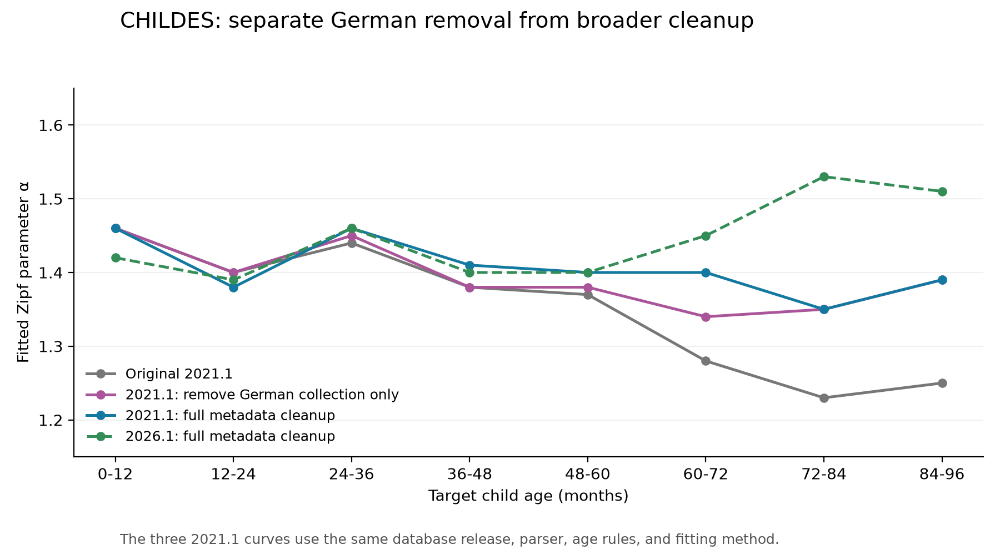

# English CHILDES metadata cleanup

The original extraction selected English-labelled participants, then queried all
speakers with the same corpus name and role. This discarded the selected speaker
identities and admitted non-English collections, including substantial German
material. The corrected pipeline requires `Eng-NA` or `Eng-UK`, exact `eng`
participant/transcript/utterance labels, the original 25 roles, and matching
speaker, transcript, corpus, and collection identities.

## Results

| Age, months | Original 2021.1 α | Remove German collection, 2021.1 α | Full cleanup, 2021.1 α | Full cleanup, 2026.1 α |
|---|---:|---:|---:|---:|
| Overall | 1.43 | 1.45 | 1.45 | 1.45 |
| 0–12 | 1.46 | 1.46 | 1.46 | 1.42 |
| 12–24 | 1.40 | 1.40 | 1.38 | 1.39 |
| 24–36 | 1.44 | 1.45 | 1.46 | 1.46 |
| 36–48 | 1.38 | 1.38 | 1.41 | 1.40 |
| 48–60 | 1.37 | 1.38 | 1.40 | 1.40 |
| 60–72 | 1.28 | 1.34 | 1.40 | 1.45 |
| 72–84 | 1.23 | 1.35 | 1.35 | 1.53 |
| 84–96 | 1.25 | 1.39 | 1.39 | 1.51 |



Removing the German collection weakens the older-bin decline on the original
release. The full cleanup on 2021.1 also leaves a smaller, nonmonotonic decline.
These are descriptive estimates; statistical significance has not been tested.
The further increase in the oldest bins on 2026.1 includes a database-release
effect whose individual source/metadata causes have not been isolated.

The German-collection control retains every other original row, including 822
age-eligible utterances in English Gleason transcripts labelled `eng deu`.
The full cleanup also excludes other non-English, multilingual, and clinical
collections. Neither definition guarantees the absence of every foreign word.

- [Same-release comparison and full 2021.1 report](english_metadata_2021_1/RUN_RESULTS.md)
- [Full 2026.1 report](english_metadata_2026_1/RUN_RESULTS.md)
- [German-collection control report](german_collection_control_2021_1/RUN_RESULTS.md)
- [All population counts and estimates](english_metadata_2021_1/same_version_comparison.csv)
- [Alpha comparison CSV](english_metadata_2021_1/alpha_comparison.csv)

## What is published

Each run contains its exact executable source snapshots, summaries, ranked
subject distributions, rank averages, MSE searches, observed/predicted curves,
plots, and aggregate verification/provenance records. The original data and
historical outputs remain intact. The control's fresh baseline reproduced all
2,802,071 historical subject–verb pairs exactly, including their order.

[PUBLISHED_ARTIFACTS.json](PUBLISHED_ARTIFACTS.json) records source paths and
SHA-256 hashes for the copied artifacts. Report links are adapted for this
published subset. The 2026.1 source snapshots precede three review safeguards;
the [run provenance](english_metadata_2026_1/audit/run_provenance.json) explains
why those safeguards do not change the saved results. Use the maintained scripts
in the experiment directory for new runs.

Full utterance CSVs, participant/transcript metadata, per-utterance pair lists,
row mappings, and logs remain on the original filesystem under:

```text
/home/jason/talkbank-data/2026-09-07/english_metadata_2021_1/
/home/jason/talkbank-data/2026-09-07/english_metadata_2026_1/
/home/jason/talkbank-data/2026-09-07/german_collection_control_2021_1/
```

In either full-cleanup run, the raw CSV is `data/childes_utterances.csv` and the
parser output is `parsed/english_ud_subject_verb_pairs.csv`. The control retains
the original population's shared parses in the same `parsed/` location, with
row membership in `audit/cohort_membership.csv`.

## Reproduction

Follow the [pipeline setup and commands](../../README.md), using a new output
directory for each release. Set `CHILDES_DB_VERSION=2021.1` on the extraction
command for the original release, or `CHILDES_DB_VERSION=2026.1` for the newer
release. The independent audit reads the saved selection policy.

The direct German-collection control uses the original CSV and archived 2021.1
transcript metadata. From the experiment directory:

```sh
python output/english_metadata_cleanup/german_collection_control_2021_1/code/run_german_control.py \
  --repository "$PWD" \
  --original-csv /absolute/path/to/childes_full_utterances_20251211_120050.csv \
  --transcripts /absolute/path/to/all_transcripts.csv \
  --output /absolute/path/to/new_german_control --shards 16
python output/english_metadata_cleanup/german_collection_control_2021_1/code/verify_german_control.py \
  /absolute/path/to/new_german_control \
  output/english_spacy_baseline \
  /absolute/path/to/filtered_language_by_age.csv
```

On the original container, both metadata CSVs are in
`/home/jason/talkbank-data/2026-09-07/documented_csv_rebuild_211155/redivis_2021_1/audit/`.
The documented historical rebuild and its source snapshots are in the parent
`documented_csv_rebuild_211155/` directory. The original CSV is at the repository
root. Its SHA-256 is
`e4a552d93ee63aa21e0c08e446d52589fd60ea9ef06f96fa1c1e7331d3e46ecb`.

To regenerate the published comparison from the saved fit artifacts, run from
the experiment directory:

```sh
python output/english_metadata_cleanup/english_metadata_2021_1/code/compare_same_version.py \
  --corrected-2021 output/english_metadata_cleanup/english_metadata_2021_1 \
  --corrected-2026 output/english_metadata_cleanup/english_metadata_2026_1 \
  --german-control output/english_metadata_cleanup/german_collection_control_2021_1 \
  --historical-baseline output/english_spacy_baseline
```
